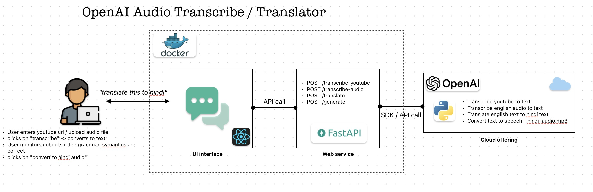

# OpenAI Audio Translator

Python POC example to leverage AI (OpenAI) to:

- Transcribe English audio mp3 file / Youtube URL to text (creates a .txt file)
- Translate english.txt file to hindi.txt file
- Generate Audio MP3 file from translated hindi.txt file



This project consists of: 

- **py_poc**: POC python project
- **api**: FastAPI rest service
- **ui**: React, Typescript based app for UI interface

## Important Links
- [OpenAI API Dashboard page](https://platform.openai.com)
- [UV homepage](https://docs.astral.sh/uv/)
- [OpenAI speech to text docs](https://platform.openai.com/docs/guides/speech-to-text)
- [Pytubefix docs page](https://pypi.org/project/pytubefix/)
- [Using Gemini to transcribe video](https://www.youtube.com/watch?v=L3qAzagAtCs)


## Test Data

- [Youtube Sample Video for Transcribe](https://www.youtube.com/watch?v=SEQcdGkzmo4)


## OpenAI API Key generation

- Login to [OpenAI API dashboard](https://platform.openai.com)
- Login using SSO (pramod.jingade@gmail.com)
- Navigate under `your profile` -> `API keys` -> `+ Create new secret key`
- Documentation for speech to text can be found in [OpenAI speech to text](https://platform.openai.com/docs/guides/speech-to-text)

## Pre-requisite

The following are the pre-requisite to run the project

#### 1. OpenAI API Key
You need to setup a `.env` file with the following key

> NOTE: OpenAI requires you have credits to use audio-text transcribe and TTS conversion features

```bash
# create .env at root folder

# your openai api key
OPENAI_API_KEY=<your-openai-api-key>
```

#### 2. Create a `downloads` folder

All the audio mp3 files and transcribed text get stored in the downloads folder


## OpenAI Costs

- Cost to transcribe 37 min audio (MP3 file)
  - Cost: $0.22
  - Time: ~1.5 mins
- Cost for TTS conversion and generate audio -> .mp3 file (into Hindi)
  - Cost: ??
  - Time: ??

---

## React Typescript with Vite, Mantine & SCSS

I'll walk you through setting up a React TypeScript project with Vite, Mantine UI, and SCSS support.

Step 1: Create the Vite React TypeScript Project

```bash
# setup react ts using vite
npm create vite@latest my-react-app -- --template react-ts
cd my-react-app
```
Step 2: Install Dependencies

- Install the base dependencies:

```bash
npm install
```
- Install Mantine UI and its dependencies:

```bash
# install mantine dependency
npm i -d @mantine/core @mantine/hooks @mantine/notifications @mantine/dates @mantine/form
```
- Install SCSS support:

```bash
# install dev dependency
npm install -D sass
```
Step 3: Configure Mantine

- Replace the contents of `src/main.tsx`:

```tsx
import React from 'react';
import ReactDOM from 'react-dom/client';
import { MantineProvider } from '@mantine/core';
import { Notifications } from '@mantine/notifications';
import App from './App.tsx';
import '@mantine/core/styles.css';
import '@mantine/notifications/styles.css';
import './index.scss';

ReactDOM.createRoot(document.getElementById('root')!).render(
  <React.StrictMode>
    <MantineProvider>
      <Notifications />
      <App />
    </MantineProvider>
  </React.StrictMode>,
);

```

Step 4: Setup SCSS Files

- Rename `src/index.css` to `src/index.scss` and update it:

```scss
// Custom variables
$primary-color: #339af0;
$secondary-color: #868e96;

// Your custom styles
body {
  margin: 0;
  font-family: -apple-system, BlinkMacSystemFont, 'Segoe UI', 'Roboto', sans-serif;
}

```

- Rename src/App.css to src/App.scss and update it:

```scss
// You can override Mantine variables here if needed
.app-container {
  max-width: 1200px;
  margin: 0 auto;
  padding: 2rem;
}

.header {
  margin-bottom: 2rem;
}
```

Step 5: Update App Component

- Replace `src/App.tsx`:


```tsx
import { Button, Container, Title, Text, Stack } from '@mantine/core'
import { notifications } from '@mantine/notifications'
import './App.scss'

function App() {
  const showNotification = () => {
    notifications.show({
      title: 'Success!',
      message: 'Mantine is working correctly',
      color: 'green',
    })
  }

  return (
    <Container className="app-container">
      <Stack gap="md">
        <div className="header">
          <Title order={1}>React + TypeScript + Vite + Mantine</Title>
          <Text c="dimmed">Your project is ready to go!</Text>
        </div>
        
        <Button onClick={showNotification}>
          Test Notification
        </Button>
      </Stack>
    </Container>
  )
}
```
- export default App

Step 6: Configure Vite (Optional)

- If you want to customize the Vite configuration, update `vite.config.ts`:

```ts
import { defineConfig } from 'vite'
import react from '@vitejs/plugin-react'

export default defineConfig({
  plugins: [react()],
  css: {
    preprocessorOptions: {
      scss: {
        additionalData: `@import "./src/styles/variables.scss";`
      }
    }
  }
});
```

- Create `src/styles/variables.scss` for global SCSS variables:

```scss
// Colors
$primary: #339af0;
$secondary: #868e96;
$success: #51cf66;
$warning: #ffd43b;
$error: #ff6b6b;

// Breakpoints
$mobile: 768px;
$tablet: 1024px;
$desktop: 1200px;
```

Step 7: Run the Development Server

```bash
npm run dev
```

Your React TypeScript project with Vite, Mantine UI, and SCSS is now ready! The setup includes:

- Vite for fast development and building
- TypeScript for type safety
- Mantine UI for components and styling
- SCSS for advanced CSS preprocessing
- Mantine Notifications for toast notifications
- Mantine Hooks for useful React hooks

You can now start building your application using Mantine components and writing styles in SCSS files.
